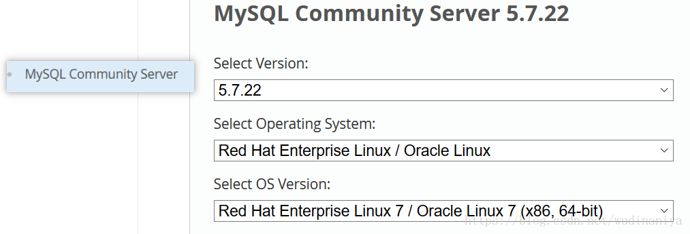
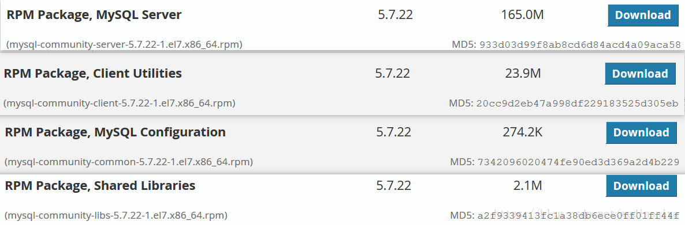
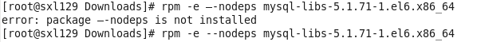
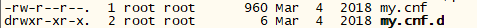
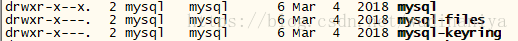

# 一     查看linux操作系统版本和系统内核版本

    [root@nfs_client ~]# cat /etc/redhat-release     查看操作系统版本
    CentOS Linux release 7.5.1804 (Core) 
    [root@nfs_client ~]# uname -r               查看系统内核版本
    3.10.0-862.el7.x86_64
 

# 二   下载对应版本的MySQL安装文件

    1、下载地址；https://dev.mysql.com/downloads/mysql/



    2、选择对应的Linux版本和x86/x64进行下载

可以选择 RPM Bundle,下载完记得解压  tar -xvf xxx.tar

 
    [root@nfs_client ~]# wget https://dev.mysql.com/get/Downloads/MySQL-5.7/mysql-5.7.22-1.el7.x86_64.rpm-bundle.tar
    也可以细化下载，下载须要的mysql组件，有4个：分别是 server、client、common、libs



# 三 卸载旧版本的MySql （没有的话，则跳过此步骤）

      1、查看旧版本MySql
      rpm -qa | grep mysql
      将会列出旧版本MySql的组件列表,有可能会有多个。

      2、逐个删除掉旧的组件
      使用命令rpm -e --nodeps {-file-name}进行移除操作，移除的时候可能会有依赖，要注意一定的顺序。



      第一次没有删除成功是因为nodeps 前面的两个中划线有一个写成了中文。

 

# 四 使用 rpm 命令安装MySql组件

使用命令rpm -ivh {-file-name}进行安装操作。

按照依赖关系依次安装rpm包 依赖关系依次为common→libs→client→server

    rpm -ivh mysql-community-common-5.7.22-1.el7.x86_64.rpm
    rpm -ivh mysql-community-libs-5.7.22-1.el7.x86_64.rpm
    rpm -ivh mysql-community-client-5.7.22-1.el7.x86_64.rpm
    rpm -ivh mysql-community-server-5.7.22-1.el7.x86_64.rpm

注：ivh中， i-install安装；v-verbose进度条；h-hash哈希校验

在安装 mysql-community-libs-5.7.22-1.el7.x86_64.rpm 时有可能会报错：mysql依赖错误

    [root@nfs_client tools]# rpm -ivh mysql-community-libs-5.7.22-1.el7.x86_64.rpm
    warning: mysql-community-libs-5.7.22-1.el7.x86_64.rpm: Header V3 DSA/SHA1 Signature, key ID 5072e1f5: NOKEY
    error: Failed dependencies:
            mysql-community-common(x86-64) >= 5.7.9 is needed by mysql-community-libs-5.7.22-1.el7.x86_64
            mariadb-libs is obsoleted by mysql-community-libs-5.7.22-1.el7.x86_64

解决：清除yum里所有mysql依赖包

    [root@nfs_client tools]# rpm -qa|grep mysql
    [root@nfs_client tools]# yum remove mysql-libs
 
注意：
有的系统可能不太一样，没有mysql-libs,而是mariadb-libs,此时要移除的则是mariadb-libs
    [root@nfs_client tools]# rpm -qa|grep mariadb
    [root@nfs_client tools]# yum remove mariadb-libs

清除完yum里所有mysql的依赖包后，再次安装mysql组件就不会报错了：

    [root@nfs_client tools]# ls
    mysql-community-client-5.7.22-1.el7.x86_64.rpm  mysql-community-libs-5.7.22-1.el7.x86_64.rpm
    mysql-community-common-5.7.22-1.el7.x86_64.rpm  mysql-community-server-5.7.22-1.el7.x86_64.rpm
    [root@nfs_client tools]# rpm -ivh mysql-community-common-5.7.22-1.el7.x86_64.rpm
    warning: mysql-community-common-5.7.22-1.el7.x86_64.rpm: Header V3 DSA/SHA1 Signature, key ID 5072e1f5: NOKEY
    Preparing...                          ################################# [100%]
    Updating / installing...
    1:mysql-community-common-5.7.22-1.e################################# [100%]
    [root@nfs_client tools]# rpm -ivh mysql-community-libs-5.7.22-1.el7.x86_64.rpm
    warning: mysql-community-libs-5.7.22-1.el7.x86_64.rpm: Header V3 DSA/SHA1 Signature, key ID 5072e1f5: NOKEY
    Preparing...                          ################################# [100%]
    Updating / installing...
    1:mysql-community-libs-5.7.22-1.el7################################# [100%]
    [root@nfs_client tools]# rpm -ivh mysql-community-client-5.7.22-1.el7.x86_64.rpm
    warning: mysql-community-client-5.7.22-1.el7.x86_64.rpm: Header V3 DSA/SHA1 Signature, key ID 5072e1f5: NOKEY
    Preparing...                          ################################# [100%]
    Updating / installing...
    1:mysql-community-client-5.7.22-1.e################################# [100%]
    [root@nfs_client tools]# rpm -ivh mysql-community-server-5.7.22-1.el7.x86_64.rpm
    warning: mysql-community-server-5.7.22-1.el7.x86_64.rpm: Header V3 DSA/SHA1 Signature, key ID 5072e1f5: NOKEY
    Preparing...                          ################################# [100%]
    Updating / installing...
    1:mysql-community-server-5.7.22-1.e################################# [100%]
    [root@nfs_client tools]# 

注意细节：
1> 执行 yum remove mysql-libs   命令后，会自动删除掉 /etc/ 下的 my.cnf 文件
2> 对于安装mysql组件，只有安装了 mysql-community-server-5.7.22-1.el7.x86_64.rpm 组件，才会:

a). 在 /etc/下生成 my.cnf 文件 和 my.cnf.d 文件夹


b). 在/var/lib/下生产以下三个文件夹


c). 在/var/log/ 下生成 mysqld.log 文件


d). 在/var/run/ 下生成 mysqld 目录


 

安装mysql需要的依赖

    [root@localhost src]# yum install libaio
    [root@localhost src]# yum install perl
    [root@localhost src]# yum install net-tools


个别情况2：

比如解决了“个别情况1”，但在启动mysql的时候，启动不起来，或启动后，去查找临时密码，使用命令没反应。查看日志mysqld.log(可在/etc/my.cnf中查找到mysqld.log的配置位置)，报如下错误，此时怎么解决？

[ERROR] Fatal error: Can't open and lock privilege tables: Table 'mysql.user' doesn't exist

此时，1>先通过rpm -e --nodeps xxx  卸载掉server，卸载后删除datadir目录，2>卸载后查看 /etc/my.cnf 中，datadir的配置情况，将datedir目录删除，3>最后通过命令rpm -ivh xxx 重新安装server,此时就能正常使用mysql了

命令代码如下：

[root@izbp1845cet96se1qmb5ekz ~]# rpm -e --nodeps mysql-community-server-5.7.22-1.el7.x86_64

[root@izbp1845cet96se1qmb5ekz ~]# cat /etc/my.cnf
xxxxxxxxxxxxx
datadir=/var/lib/mysql
socket=/var/lib/mysql/mysql.sock

xxxxxxxxxxxxxxx

[root@izbp1845cet96se1qmb5ekz ~]# cd /var/lib

[root@izbp1845cet96se1qmb5ekz lib]# rm -rf mysql

[root@izbp1845cet96se1qmb5ekz ~]# rpm -ivh mysql-community-server-5.7.22-1.el7.x86_64.rpm

[root@izbp1845cet96se1qmb5ekz ~]# systemctl start mysqld.service
[root@izbp1845cet96se1qmb5ekz ~]# ps -ef|grep mysql
root      3306  1068  0 14:34 pts/0    00:00:00 mysql -uroot -p
mysql    27009     1  1 15:26 ?        00:00:00 /usr/sbin/mysqld --daemonize --pid-file=/var/run/mysqld/mysqld.pid
root     27038 26239  0 15:27 pts/6    00:00:00 grep --color=auto mysql

 

# 五 登录并创建MySql密码

### 1 启动MySql

安装完后，使用命令 service mysqld start 或 systemctl start mysqld.service 启动MySQL服务。（如果mysql服务无法启动，就重启一下系统）

    systemctl start mysqld.service    启动mysql
    systemctl status mysqld.service  查看mysql状态
    systemctl stop mysqld.service   关闭mysql

    查看mysql进程 ps -ef|grep mysql
    查看3306端口 netstat -anop|grep 3306

eg：

    [root@nfs_client tools]# ps -ef|grep mysql
    mysql      4102      1  0 14:29 ?        00:00:01 /usr/sbin/mysqld --daemonize --pid-file=/var/run/mysqld/mysqld.pid
    root       4806   1464  0 14:43 pts/0    00:00:00 grep --color=auto mysql
    [root@nfs_client tools]# ps -ef|grep mysqld
    mysql      4102      1  0 14:29 ?        00:00:01 /usr/sbin/mysqld --daemonize --pid-file=/var/run/mysqld/mysqld.pid
    root       4829   1464  0 14:43 pts/0    00:00:00 grep --color=auto mysqld
    [root@nfs_client tools]# firewall-cmd --state
    not running
    [root@nfs_client tools]# netstat -anop|grep 3306
    tcp6       0      0 :::3306                 :::*                    LISTEN      4102/mysqld          off (0.00/0/0)
    [root@nfs_client tools]#

### 2 登陆mysql修改root密码

由于MySQL5.7.4之前的版本中默认是没有密码的，登录后直接回车就可以进入数据库，进而进行设置密码等操作。其后版本对密码等安全相关操作进行了一些改变，在安装过程中，会在安装日志中生成一个临时密码。

      怎么找到这个临时密码呢？

      使用：

grep 'temporary password' /var/log/mysqld.log
     即可查询到类似于如下的一条日志记录：

    [root@nfs_client tools]# grep 'temporary password' /var/log/mysqld.log    # 在/var/log/mysqld.log文件中搜索字段‘temporary password’
    2018-07-18T06:02:23.579753Z 1 [Note] A temporary password is generated for root@localhost: n(jPp4l-C33#

n(jPp4l-C33#即为登录密码。使用这个随机密码登录进去，然后修改密码，使用命令：

    mysql -uroot -p

```bash
[root@nfs_client tools]# mysql -uroot -p
Enter password:   # 在这里输入密码
Welcome to the MySQL monitor.  Commands end with ; or \g.
Your MySQL connection id is 2
Server version: 5.7.22

Copyright (c) 2000, 2018, Oracle and/or its affiliates. All rights reserved.

Oracle is a registered trademark of Oracle Corporation and/or its
affiliates. Other names may be trademarks of their respective
owners.

Type 'help;' or '\h' for help. Type '\c' to clear the current input statement.
 
mysql> quit      # 输入quit 或 exit 都能退出mysql
Bye
```

执行下面的命令修改MySql root密码

在5.6后,mysql内置密码增强机制,低强度密码会报错:

    ERROR 1819 (HY000): Your password does not satisfy the current policy requirements

    mysql> alter user root@localhost identified by 'sdbrk';
    ERROR 1819 (HY000): Your password does not satisfy the current policy requirements
                或
    mysql> set password for root@localhost=password('sdbrk');
    ERROR 1819 (HY000): Your password does not satisfy the current policy requirements
 

解决方案如下：

可参见：ERROR 1819 （HY000）：Your password does not satisfy the current policy requirments

 
step1： 更改策略，设置 validate_password_policy=0;

    mysql> set global validate_password_policy=0;    
    # 此时，新密码长度大于等于8位才有效，否则报错

    修改有效密码长度：
    mysql> set global validate_password_length=1;
    
    不管设置  validate_password_length=1,还是2,3,4 ,‘有效密码长度’这个参数的实际值都是4。超过4后设置是多少实际就是多少。

step2：重设密码：

    mysql> set password for root@localhost=password('9527');
 
    此时，虽然防火墙我时关着的，但root用户只能用于本机访问，不能用于远程访问，否则会报以下错误。因此，接下来要做的是授予root用户远程访问权限。

# 六.赋予用户远程访问权限

查看当前授予过的权限：

    mysql> use mysql;
    Reading table information for completion of table and column names
    You can turn off this feature to get a quicker startup with -A
    
    Database changed
    mysql> select user,host from user;
    +---------------+-----------+
    | user          | host      |
    +---------------+-----------+
    | root          | %         |
    | mysql.session | localhost |
    | mysql.sys     | localhost |
    | root          | localhost |
    +---------------+-----------+
    4 rows in set (0.00 sec)
    
    mysql> show grants;
    +---------------------------------------------------------------------+
    | Grants for root@localhost                                           |
    +---------------------------------------------------------------------+
    | GRANT ALL PRIVILEGES ON *.* TO 'root'@'localhost' WITH GRANT OPTION |
    | GRANT PROXY ON ''@'' TO 'root'@'localhost' WITH GRANT OPTION        |
    +---------------------------------------------------------------------+
    2 rows in set (0.00 sec)
 
 step1: 授予root用户远程访问权限：

    mysql> grant all privileges on *.* to root@'%' identified by '123456';


step2: 刷新权限，使设置生效， OK。

    mysql> flush privileges;

在远程机器上测试远程连接：  mysql -h192.168.0.241 -uroot -p

    [root@localhost ~]# mysql -h192.168.0.241  -uroot -p
    Enter password: 
    Welcome to the MySQL monitor.  Commands end with ; or \g.
    Your MySQL connection id is 20
    Server version: 5.7.22 MySQL Community Server (GPL)
    
    Copyright (c) 2000, 2018, Oracle and/or its affiliates. All rights reserved.
 
    Oracle is a registered trademark of Oracle Corporation and/or its
    affiliates. Other names may be trademarks of their respective
    owners.
    
    Type 'help;' or '\h' for help. Type '\c' to clear the current input statement.
    
    mysql> show grants;
    +-------------------------------------------+
    | Grants for root@%                         |
    +-------------------------------------------+
    | GRANT ALL PRIVILEGES ON *.* TO 'root'@'%' |
    +-------------------------------------------+
    1 row in set (0.01 sec)
 
    mysql> 
 

mysql中可以给一个用户授予如select,insert,update,delete等其中的一个或者多个权限,主要使用grant命令,用法格式为： 
grant 权限 on 数据库对象 to 用户 
一、grant 普通数据用户，查询、插入、更新、删除 数据库中所有表数据的权利。 
grant select on testdb.* to common_user@'%'
grant insert on testdb.* to common_user@'%' 
grant update on testdb.* to common_user@'%' 
grant delete on testdb.* to common_user@'%' 
或者，用一条 MySQL 命令来替代： 
grant select, insert, update, delete on testdb.* to common_user@'%'

# 七、配置my.cnf-可选

打开配置文件my.cnf

    [root@localhost src]# vi /etc/my.cnf

在[mysqld]下面配置几行

    lower_case_table_names=1       #配置表名不区分大小写 1：不区分大小写 0：区分大小写  这行必须配置 默认表名是区分大小写的，不利于开发

    character-set-server=utf8          #设置为默认编码为utf8

    init_connect='SET NAMES utf8'

    max_connections=1024             #设置最大连接数

重启mysql 重启配置才能生效

    [root@localhost src]# service mysqld restart

# 八、连接不了的解决问题

### 1、查看该用户是否有远程登录的权限
```sql
mysql> SELECT * FROM mysql.user;
+-----------+-----------+
| User | Host |
+-----------+-----------+
| M | % |
| mysql.sys | localhost |
| root | localhost |
| tommy | ％ |
| showhilllee | ％ |
+-----------+-----------+
5 rows in set (0.00 sec)
```

### 2、查看 MySQL Server 是不是监听了 3306 端口
执行命令netstat -tulpen

    [root@localhost ~]# netstat -tulpen
    Active Internet connections (only servers)
    Proto Recv-Q Send-Q Local Address           Foreign Address         State       User       Inode      PID/Program name
    tcp        0      0 0.0.0.0:22              0.0.0.0:*               LISTEN      0          17289      1360/sshd
    tcp6       0      0 :::22                   :::*                    LISTEN      0          17298      1360/sshd
    tcp6       0      0 :::3306                 :::*                    LISTEN      27         18230      1618/mysqld
    udp        0      0 127.0.0.1:323           0.0.0.0:*                           0          14749      702/chronyd
    udp6       0      0 ::1:323                 :::*                                0          14751      702/chronyd

### 3、如果服务器是 CentOS7，将 MySQL 服务加入防火墙

执行命令

    sudo firewall-cmd --zone=public --permanent --add-service=mysql
    
返回success。然后继续执行

    sudo systemctl restart firewalld